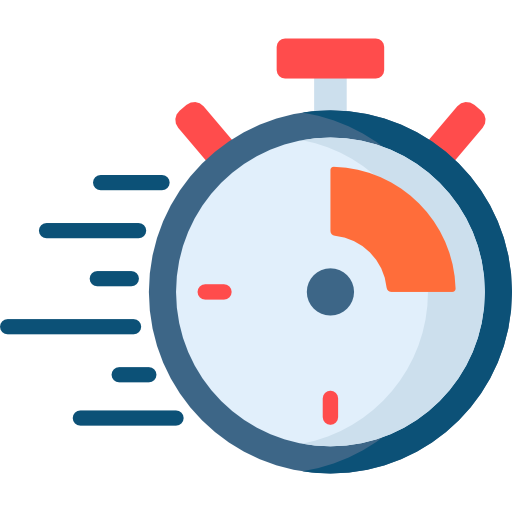
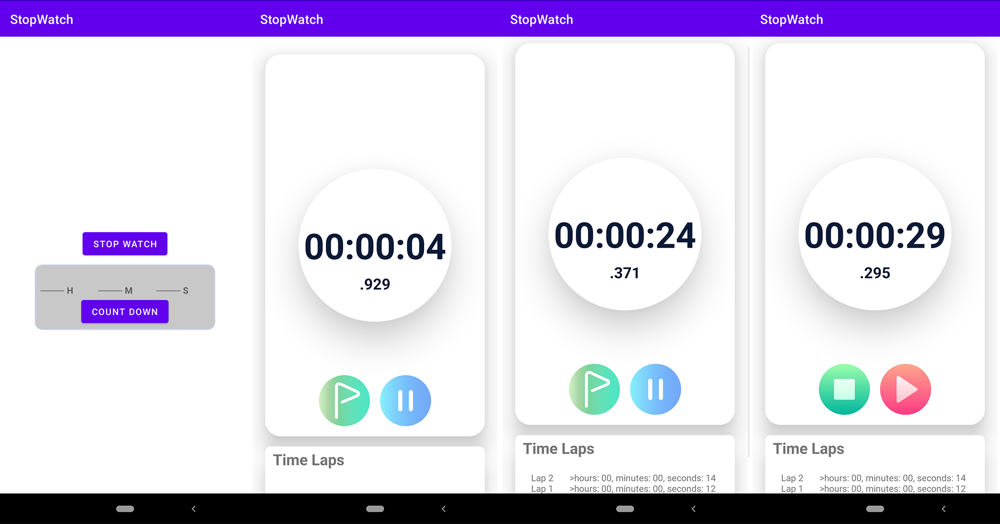
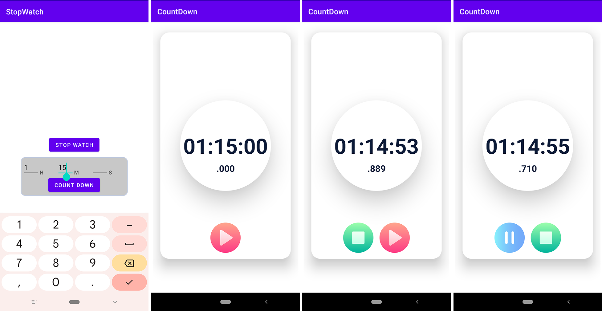

# Stopwatch - Android(JAVA) Application

A Stopwatch & Timer app that can run in the background and can show the time accordingly. It was a project for my university course CSE489 Mobile Application Development Midterm exam. Our main task was to complete the app using services. So I used service class and broadcast receiver to cast the time in milliseconds. And Update foreground with converted Hours: Minute: Second. milliseconds format. App UI is fully responsive. but supports only portrait mode.

## Features

- Simple Ui
- can perform as a timer as well
- Show Lap for stopwatch
- Play, Pause and stop button
- Used froground service so that app can run even in locked screen and backgound
- Responsive ui
- Small in size

## Icon

<!--
## Demo

 -->

## Screenshots

## Acknowledgements

 - [mammadovramil/Stopwatch](https://github.com/mammadovramil/Stopwatch)

## 🔗 Links

